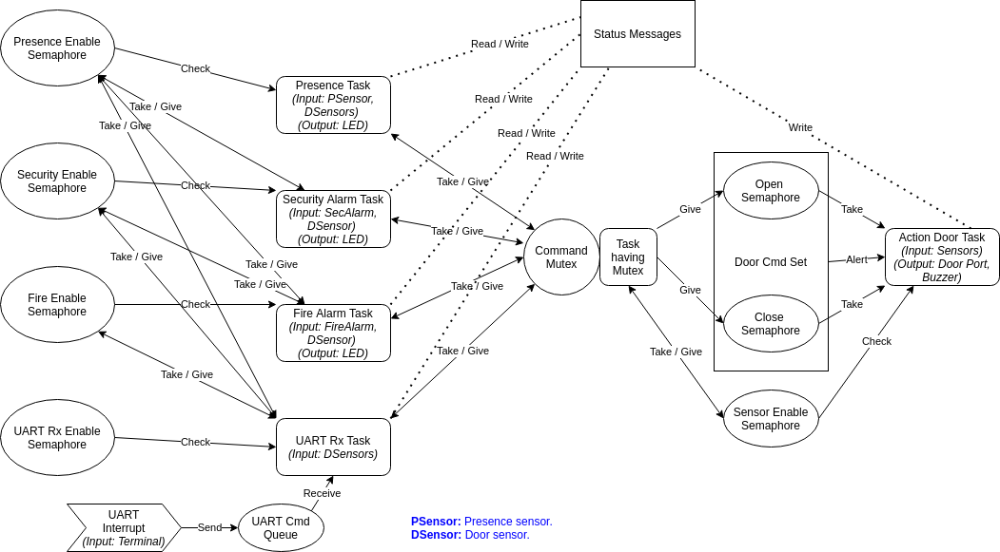

# PIC24_AutoDoor project #
## What is it? #
PIC24_AutoDoor is a miniproject consisting of a **realtime** software system that commands a door based on some inputs. The application is using the **FreeRTOS 10** framework and implemented on a *Labcenter Electronics Proteus v8.5* **PIC24**_FJ128GA010_ simulation model.

> Note: Thanks to the portability that FreeRTOS offers, it is possible to implement this application on another supported CPU architecture with few modifications to make (port configs, oscillator config, interrupts,...).

## How is the system designed? #
  
To get a clearer idea about how the system works, you can play [this video](ProteusProject/Media1.webm).  
**Please note that the timing issues _(LED fast or slow, weird Buzzing)_ occur especially when the mouse cursor moves. This shows that the issues are due to simulation rather than the application itself.**

### Inputs #
The system has 4 command inputs, 2 sensor inputs and a reset signal.  
The command inputs are:

+ **Presence signal:** sent by a proximity sensor that detects if somebody/something is in front of the door. It is represented by a button in the simulation design.
+ **Security alarm signal:** sent by a security alarm. It is represented by a switch in the simulation design.
+ **Fire alarm signal:** sent by a fire alarm. It is represented by a switch in the simulation design.
+ **UART command:** sent by a serial terminal. It is represented by a virtual terminal in the simulation design. The default baudrate is **9600**.

The sensor inputs are:

+ **Sensor_O signal:** sent by a short-range proximity sensor that detects that the door has reached an obstacle while opening. It can be triggered by the switch *ERROR_O* in the simulation design.
+ **Sensor_C signal:** sent by a short-range proximity sensor that detects that the door has reached an obstacle while closing. It can be triggered by the switch *ERROR_C* in the simulation design.

The edges of the doorway are logically also considered obstacles. That is useful in case of a dysfunction of the door driver.

### Outputs #
The system has 4 LED outputs, a buzzer output and a door command output bus.  
The LED outputs are:

+ **Presence LED:** is ON when the presence signal is high, OFF otherwise. It is connected to the MCU and not directly to the signal in order to get what the application is considering.
+ **Security LED:** is ON when the security alarm signal is high, OFF otherwise. It is connected to the MCU and not directly to the signal in order to get what the application is considering.
+ **Fire LED:**  is ON when the fire alarm signal is high, OFF otherwise. It is connected to the MCU and not directly to the signal in order to get what the application is considering.
+ **Stack Overflow LED:** turns ON if a stack overflow occurs. Exclusive for developer use.

The buzzer is turned ON when the door is opening or closing, otherwise the buzzer is OFF.  

When it comes to the door command, and for more visibility _(impact of sensors, of preemption,...)_, it is not considered as a single pin controlling a relay of an electrical motor. The challenge is made a little bit harder by using a 4-pin bus. Each pin controls a NPN transistor through which it commands a LED that represents a step on the doorway.  
If the four LEDs are ON, it means that the door is fully closed.  
If the four LEDs are OFF, it means that the door is fully open.  

## How does the system work? #
If a *PRESENCE* is detected, the door is opened. If there is no *presence*, the door is closed.  
If the *SECURITY* alarm is ON, the door is closed regardless of the *presence* signal. Thieves should not be able to get away.  
If the *FIRE* alarm is ON, the door is opened regardless of the *presence* and *security* signals. Safety comes first!  
If an *UART* command is received, the latter is executed regardless of the other signals. The operator has given their order.

If *Sensor_O* and *Sensor_C* are enabled for a given event, the door opens/closes until either it reaches an obstacle (object or edge detected by sensor) or the door driver reaches the limit. If disabled, only the driver limits are taken into account.  
Here is the default sensor configuration for the different events. They can be changed by editing corresponding macros in **Demo/PIC24_AutoDoor/mydoor.c**.

|   Event     |   Default configuration |
|   :-------: |   :-----------: |
|   Presence  |   Enabled |
|   Security  |   Disabled  |
|   Fire      |   Disabled  |
|   UART      |   Disabled  |

As for UART commands, they are as follows:

|   Aim       | Command to insert |
|   :-------: | :---------------: |
|   Open door | **:o** then **Enter** |
|   Close door| **:c** then **Enter** |
|   Free door | **:f** then **Enter** |
> Note1: "To free" the door means to stop the command and take the other events into account again.  

> Note2: If it is intended to implement the application on real MCU, please go to the **ISR** and **uartRXTask** in *Demo/PIC24_AutoDoor/mydoor.c* and make the changes described in the comments there. The code had to be adjusted due to simulation timing issues.

## How is the application designed? #

## Remarks #
### Why using a RTOS? #
It is true that the functionalities of this system could have been achieved with a simpler program by nesting if-conditions for example.
But some essential RTOS guarantees would be missing then.
